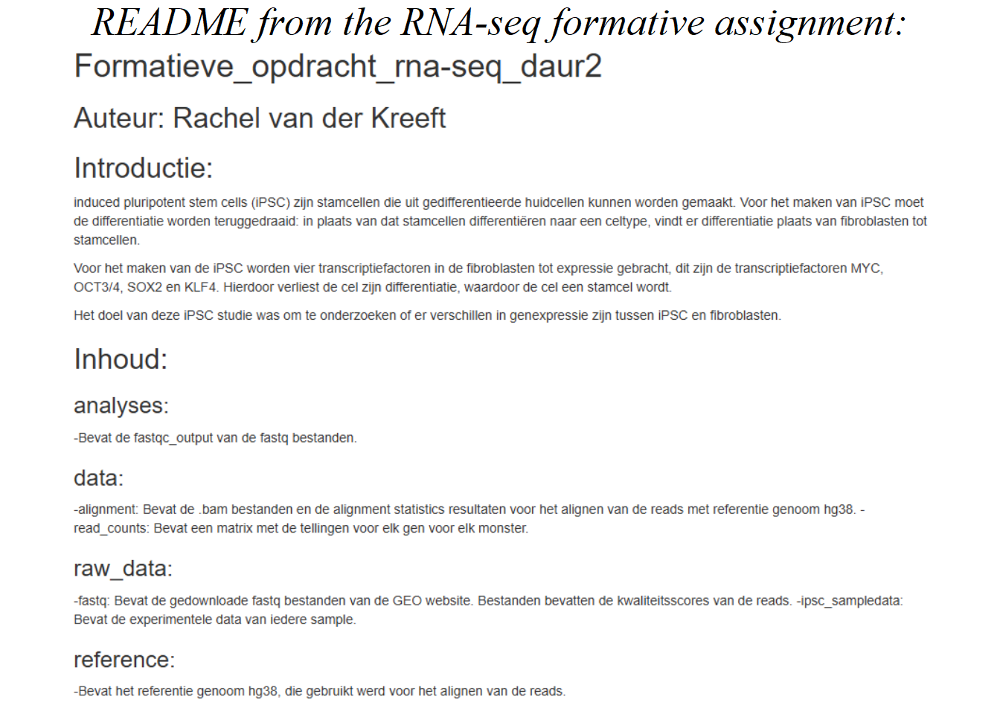
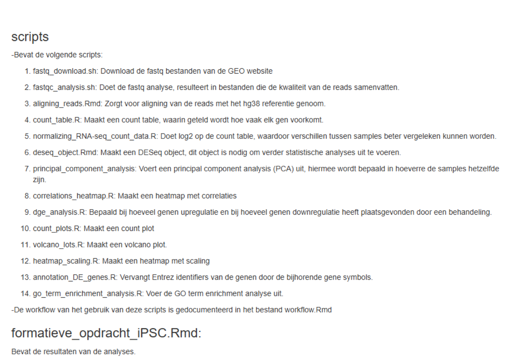

# RNA-sequencing repository


```
## C:/Users/rache/Documents/dsfb2/dsfb2_workflows_portfolio/dsfb2_workflows_portfolio/bookdown
## ├── 01-curriculum_vitae.Rmd
## ├── 02-plan_voor_de_toekomst.Rmd
## ├── 03-vrije_opdracht.Rmd
## ├── 04-formatieve_opdracht_rna-seq_daur2.Rmd
## ├── 04-formatieve_opdracht_rna-seq_daur2_files
## │   ├── figure-html
## │   │   ├── readme-1.png
## │   │   └── readme-2.png
## │   └── figure-latex
## │       ├── readme-1.pdf
## │       └── readme-2.pdf
## ├── 05-portfolio_repository.Rmd
## ├── 05-portfolio_repository_files
## │   ├── figure-html
## │   │   └── readme-1.png
## │   └── figure-latex
## │       └── readme-1.pdf
## ├── book.bib
## ├── bookdown-demo.tex
## ├── bookdown-portfolio.rds
## ├── bookdown-portfolio.Rproj
## ├── bookdown-portfolio.tex
## ├── curriculum_vitae.html
## ├── DESCRIPTION
## ├── Dockerfile
## ├── index.Rmd
## ├── LICENSE
## ├── now.json
## ├── packages.bib
## ├── preamble.tex
## ├── README.md
## ├── render412424a04110.rds
## ├── style.css
## ├── toc.css
## ├── _book
## │   ├── 01-curriculum_vitae.md
## │   ├── 01-intro.md
## │   ├── 02-curriculum_vitae.md
## │   ├── 02-plan_voor_de_toekomst.md
## │   ├── 03-plan_voor_de_toekomst.md
## │   ├── 03-vrije_opdracht.md
## │   ├── 04-formatieve_opdracht_rna-seq_daur2.md
## │   ├── 04-formatieve_opdracht_rna-seq_daur2_files
## │   │   └── figure-html
## │   │       ├── readme-1.png
## │   │       └── readme-2.png
## │   ├── 04-portfolio_repository.md
## │   ├── 04-portfolio_repository_files
## │   │   └── figure-html
## │   │       └── readme-1.png
## │   ├── 05-formatieve_opdracht_rna-seq_daur2.md
## │   ├── 05-formatieve_opdracht_rna-seq_daur2_files
## │   │   └── figure-html
## │   │       ├── readme-1.png
## │   │       └── readme-2.png
## │   ├── 05-portfolio_repository.md
## │   ├── 05-portfolio_repository_files
## │   │   └── figure-html
## │   │       └── readme-1.png
## │   ├── 06-portfolio_repository.md
## │   ├── 06-portfolio_repository_files
## │   │   └── figure-html
## │   │       └── readme-1.png
## │   ├── 404.html
## │   ├── bookdown-demo_files
## │   │   └── figure-html
## │   │       └── nice-fig-1.png
## │   ├── bookdown-portfolio_files
## │   │   └── figure-html
## │   │       └── nice-fig-1.png
## │   ├── curriculum-vitae.html
## │   ├── curriculum_vitae.html
## │   ├── formatieve-opdracht-rna-sequencing-repository.html
## │   ├── index.html
## │   ├── index.md
## │   ├── libs
## │   │   ├── anchor-sections-1.1.0
## │   │   │   ├── anchor-sections-hash.css
## │   │   │   ├── anchor-sections.css
## │   │   │   └── anchor-sections.js
## │   │   ├── gitbook-2.6.7
## │   │   │   ├── css
## │   │   │   │   ├── fontawesome
## │   │   │   │   │   └── fontawesome-webfont.ttf
## │   │   │   │   ├── plugin-bookdown.css
## │   │   │   │   ├── plugin-clipboard.css
## │   │   │   │   ├── plugin-fontsettings.css
## │   │   │   │   ├── plugin-highlight.css
## │   │   │   │   ├── plugin-search.css
## │   │   │   │   ├── plugin-table.css
## │   │   │   │   └── style.css
## │   │   │   └── js
## │   │   │       ├── app.min.js
## │   │   │       ├── clipboard.min.js
## │   │   │       ├── jquery.highlight.js
## │   │   │       ├── plugin-bookdown.js
## │   │   │       ├── plugin-clipboard.js
## │   │   │       ├── plugin-fontsettings.js
## │   │   │       ├── plugin-search.js
## │   │   │       └── plugin-sharing.js
## │   │   └── jquery-3.6.0
## │   │       └── jquery-3.6.0.min.js
## │   ├── literature.html
## │   ├── methods.html
## │   ├── plan-voor-de-toekomst.html
## │   ├── portfolio-repository.html
## │   ├── reference-keys.txt
## │   ├── references.html
## │   ├── rna-sequencing-repository.html
## │   ├── search_index.json
## │   ├── style.css
## │   └── vrije-opdracht.html
## ├── _bookdown.yml
## ├── _bookdown_files
## ├── _build.sh
## ├── _deploy.sh
## ├── _output.yml
## └── _publish.R
```


