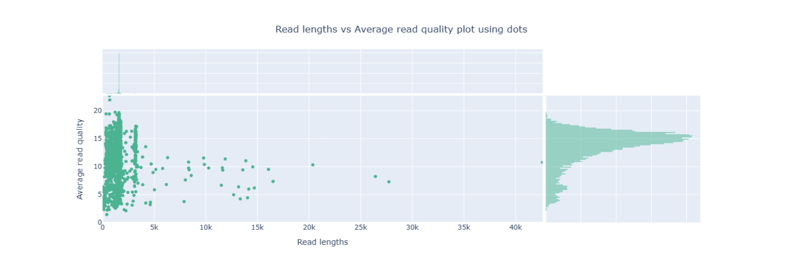
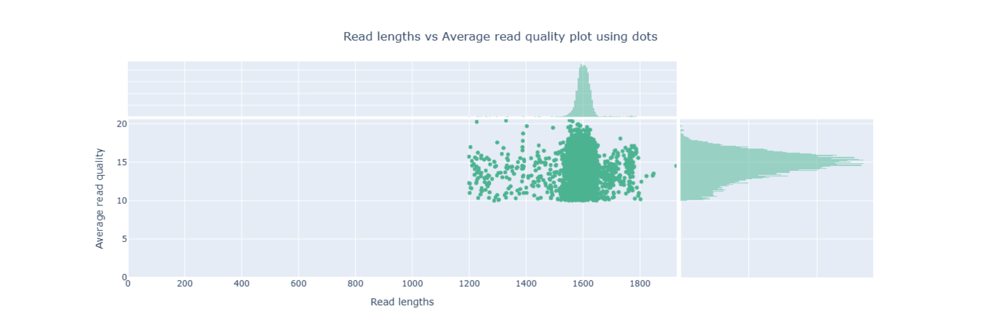
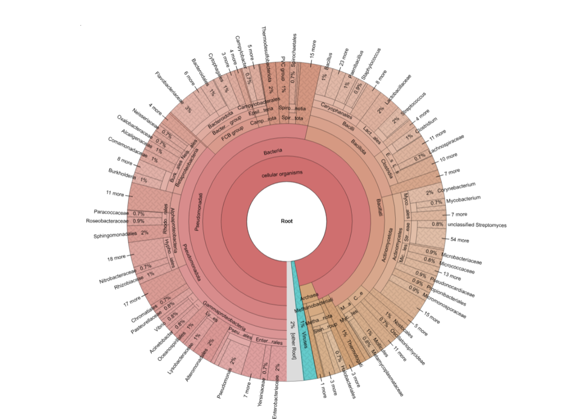
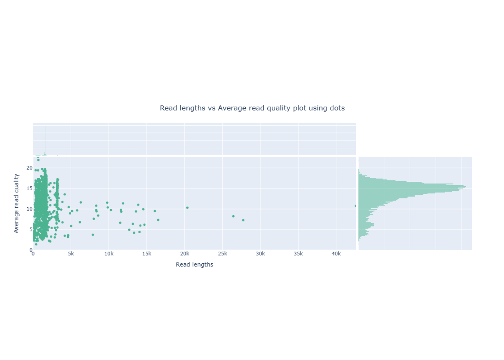
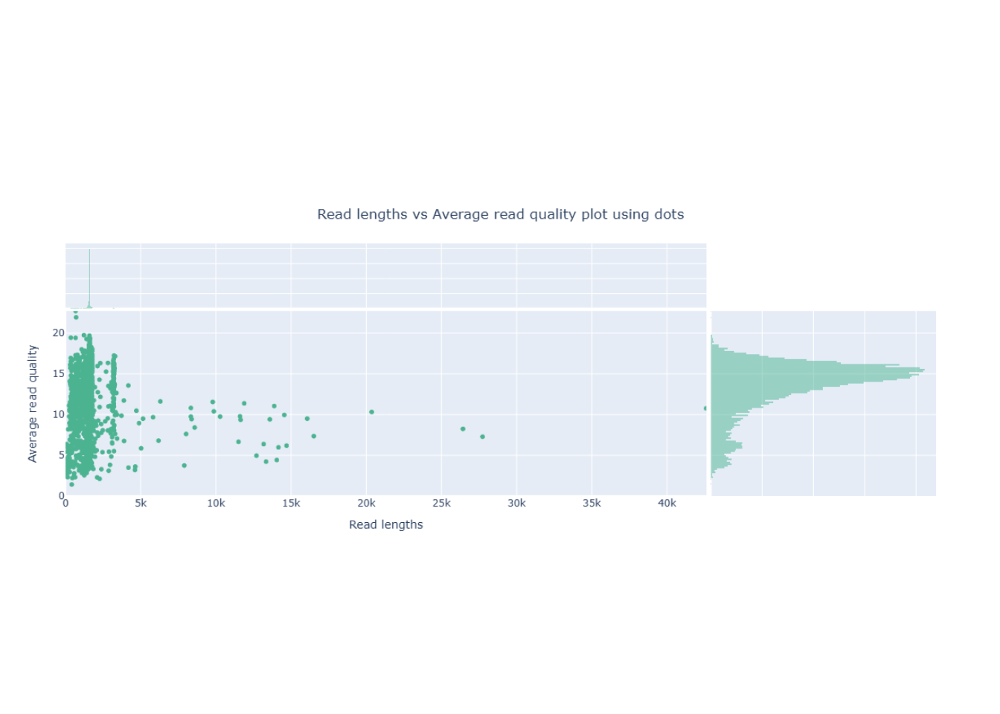
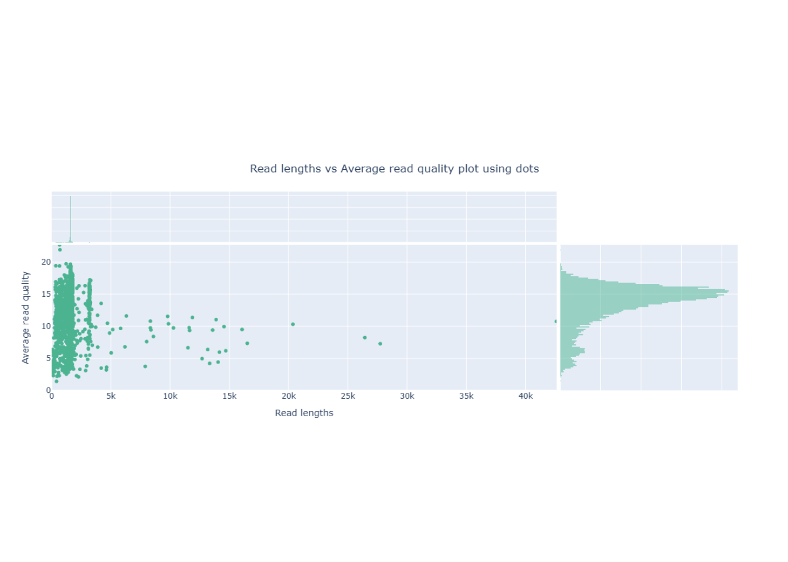
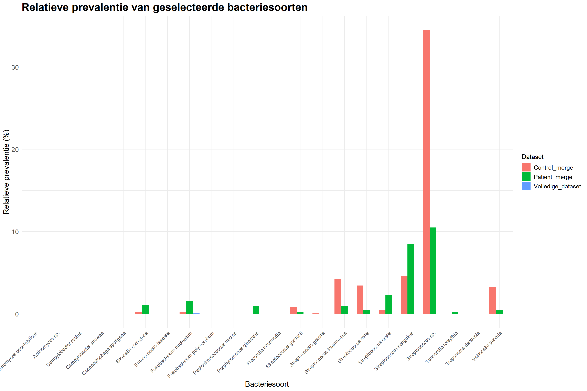
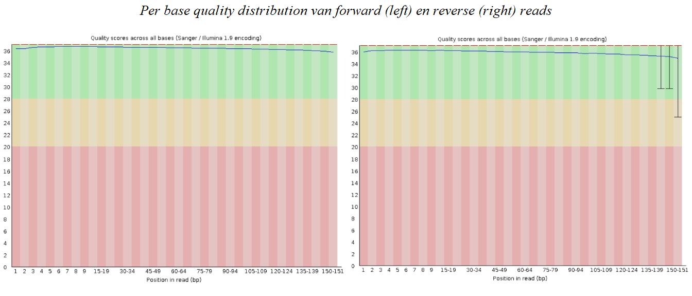
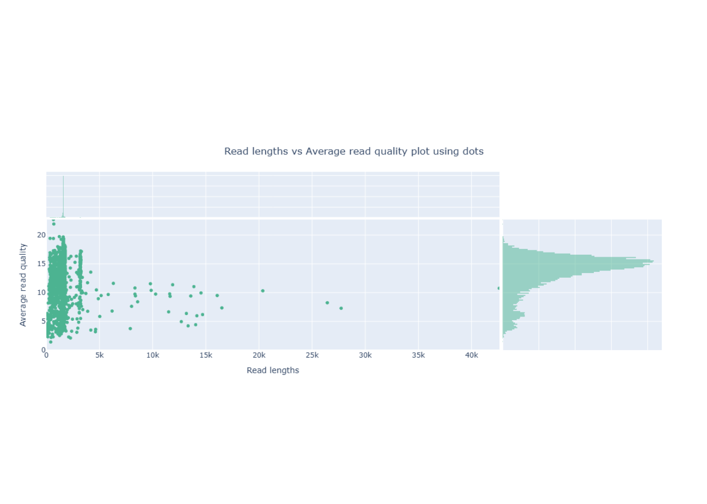
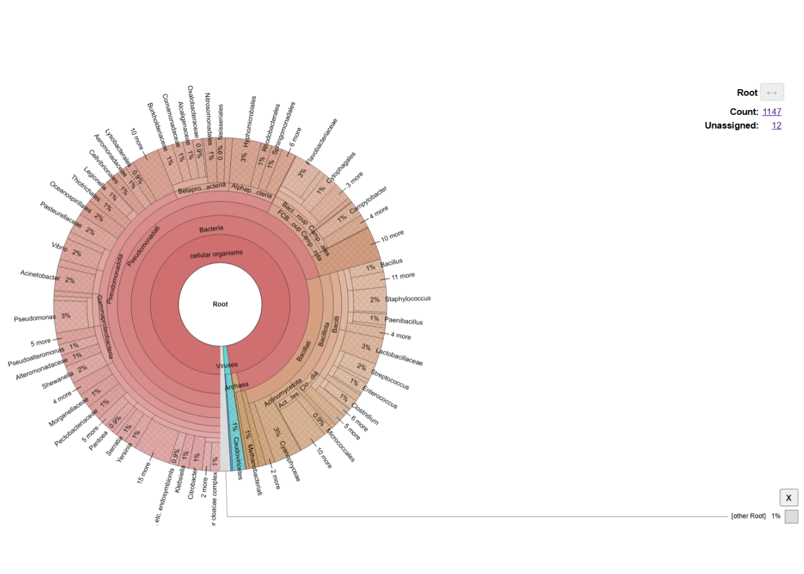

# Vrije opdracht - Uitvoering {#vrije-opdracht-uitvoering}

Belangrijk: Omdat het aangeleverde bestand en de bestanden die met deze workflow gegenereerd werden veel opslag innemen, is besloten om de opdracht in de Rstudio server uit te werken in plaats van de lokale versie. Voor zover mogelijk zijn de gegenereerde bestanden in de [repository](https://github.com/RachelvanderKreeft/dsfb2_workflows_portfolio.git) geplaatst.


``` r
# Importeren van PNG bestanden
library(png)
library(grid)
library(gridExtra)

# Importeren van Excel bestanden
library(readxl)

# Grafieken maken
library(tidyverse)
library(ggplot2)
```

## conda installeren
Dit onderdeel hoeft alleen uitgevoerd te worden indien het conda installatie script nog niet is geïnstalleerd in Rstudio. Indien conda al is geïnstalleerd: begin bij stap 2. \


``` bash

# Download het conda installatie script
wget https://repo.anaconda.com/miniconda/Miniconda3-latest-Linux-x86_64.sh

# Run het conda installatie script
bash Miniconda3-latest-Linux-x86_64.sh -b

# Belangrijk: Na installatie, sluit de terminal en open vervolgens een nieuwe terminal (menubalk -> tools -> terminal). Dit is nodig om (mini)conda te initieren

```

## conda environment opzetten
Voor deze analyse werden twee environments aangemaakt. In de eerste environment werden de packages samtools, NanoPlot, kraken2 en bracken geïnstalleerd. In de tweede environment werd krona geïnstalleerd. Krona moet in een aparte environment worden geïnstalleerd omdat krona andere dependencies heeft. \


``` bash

# Aanmaken van een environment met samtools, NanoPlot, kraken2 en bracken
conda create -n nanopore_clean -c conda-forge -c bioconda \
samtools nanoplot kraken2 bracken

# Activeer de environment
conda activate nanopore_clean

# Maak een aparte environment voor krona (krona heeft namelijk andere dependencies)
conda create -n krona

# Installeer de krona package in de nieuwe environment (krona werd op een andere manier geïnstalleerd omdat conda create -n in een incomplete installatie resulteerde)
conda install bioconda::krona

# Deactiveer de krona environment
conda deactivate

# Activeer de environment nanopore_clean opnieuw
conda activate nanopore_clean

```

### Krona handmatig installeren
Soms mist krona na installatie het taxonomy bestand. Wanneer ktImportTaxonomy van de krona package dan wordt gebruikt, resulteert dit in de melding ''Taxonomy not found in...''. Indien dit het geval is, kunnen de onderstaande stappen worden uitgevoerd om alsnog het taxonomy bestand te downloaden. \


``` bash

# Krona handmatig installeren
# Stap 1 — ga naar taxonomy folder
cd ~/miniconda3/envs/krona/opt/krona/taxonomy

# Stap 2 — download direct (belangrijk)
wget https://ftp.ncbi.nlm.nih.gov/pub/taxonomy/taxdump.tar.gz

# Stap 3 — unpack
tar -xzf taxdump.tar.gz

# Stap 4 — check resultaat
ls

```

\
De Python versie in de environment nanopore_clean was 3.13.13. De versies van de packages waren als volgt: \
-samtools 1.23.1 \
-NanoPlot 1.46.2 \
-kraken2  2.0.8_beta \
-bracken  3.1 \
\
In de environment krona werd versie 2.8.1 van krona gebruikt. \
\

## Van .bam naar .fastq

De output van de nanopore sequencing werd in de Rstudio server aangeleverd als een .bam bestand. Het originele output bestand van de sequencing is terug te vinden in de Rstudio server van daur1 via de volgende pathway:
/home/data/projecticum/nanopore/paradontitis/16S114_exp1_VL5B06_11122025 \
\
Met behulp van samtools werd het .bam bestand omgezet naar een fastq bestand. \
\
Belangrijk: Vaak worden output bestanden als fastq aangeleverd. Indien dit het geval is, kan stap 3 worden overgeslagen. \
\


``` bash

# Zet het .bam bestand om in een .fastq bestand
samtools fastq "~/parodontitis16s/raw_data/16S_exp1_11122025.bam" > "~/parodontitis16s/data/16S_exp1_11122025_filtered.fastq"

```

\
Belangrijk: Demultiplexing werd in het oorspronkelijke project uitgevoerd met MinKNOW op een krachtigere rekenomgeving. Voor deze heranalyse was deze stap niet reproduceerbaar omdat er geen krachtige rekenomgeving beschikbaar was en omdat alleen het .bam bestand beschikbaar was zonder ruwe barcode-informatie. De demultiplexing werd waarschijnlijk oorspronkelijk op het FAST5 bestand uitgevoerd en dit bestand is alleen beschikbaar op de laptop waarop de nanopore sequencing was uitgevoerd. Daarom is ervoor gekozen om de rest van de analyse op de dataset met alle samples uit te voeren. Dit betekent wel dat de data voor de parodontitis samples en de samples van de gezonde personen niet van elkaar gescheiden zijn, wat betekent dat de resultaten van analyses kunnen afwijken van de resultaten van het projecticum. \
\

## Analyse met NanoPlot
NanoPlot is een quality control tool voor Nanopore sequencing data. Het genereert statistieken en visualisaties over readlengte, kwaliteit en sequencing output. \
\
Eerst werd de NanoPlot analyse uitgevoerd zonder de data te filteren. \
\


``` bash

# Voer een NanoPlot analyse uit zonder de reads te filteren
NanoPlot \
--fastq ~/parodontitis16s/data/16S_exp1_11122025_filtered.fastq \
--outdir ~/parodontitis16s/nanoplot_output \
--threads 6

```

\
Hieronder staat een samenvatting van de statistieken van de NanoPlot analyse.
\
\
General summary: \        
Mean read length:                 1,612.0 \
Mean read quality:                   11.8 \
Median read length:               1,597.0 \
Median read quality:                 14.2 \
Number of reads:              5,582,411.0 \
Read length N50:                  1,600.0 \
STDEV read length:                1,054.3 \
Total bases:              8,998,837,569.0 \
Number, percentage and megabases of reads above quality cutoffs \
>Q10:	4778884 (85.6%) 7677.8Mb \
>Q15:	1975244 (35.4%) 3176.4Mb \
>Q20:	1611 (0.0%) 2.2Mb \
>Q25:	13 (0.0%) 0.0Mb \
>Q30:	3 (0.0%) 0.0Mb \
\

Zoals hierboven te zien is, had 85.6% van de reads een kwaliteitsscore van >Q10. 35.4% van deze reads had een kwaliteitsscore van >Q15. Slechts 1627 reads hadden een kwaliteitsscore van Q20 of hoger.
\
\
In figuur 1 is de lengte van de reads uitgezet tegen de kwaliteit van deze reads bij de ongefilterde data. \
\

<div class="figure">

<p class="caption">(\#fig:unnamed-chunk-6)Figuur 1: Lengte van de nanopore sequencing reads uitgezet tegen de kwaliteit van de reads van de ongefilterde data.</p>
</div>

\
Zoals in figuur 1 te zien is, waren de meeste reads 5k of kleiner. Een paar reads waren veel groter dan de rest van de reads. Het is voor deze reads mogelijk dat twee of meer DNA-fragmenten tijdens de library prep aan elkaar zijn gaan plakken. De meeste van deze reads hadden een kwaliteitsscore van minder dan Q10, dus het is ook mogelijk dat een deel van het DNA niet goed is afgelezen tijdens de sequencing, waardoor ze als één lange read werden geregistreerd. \
\

## Reads filteren
Voordat verdere analyse op de dataset uitgevoerd kan worden, moeten eerst de reads gefilterd worden op kwaliteitsscore en lengte van de reads.
\
\
Voor het project werd de data gefilterd op een kwaliteitsscore van >Q10 en een lengte van 1200 tot 2000 bp. Bij nanopore sequencing is de error rate hoger dan bij illuma, daarom werd deze dataset gefilterd op >Q10 in plaats van >Q30, dit betekent dat de kans dat de reads kloppen 90% is. Daarnaast werd op een lengte van 1200 tot 2000 bp gefilterd omdat verwacht werd dat de 16s regio's van de meeste bacteriën ongeveer tussen de 1400 bp en 1600 bp lang zou zijn, maar bekend was dat sommige bacteriesoorten een kortere of langere 16s regio konden hebben. 
\
\
Voor deze analyse werd gekozen om de data deze keer op dezelfde manier te filteren. \
\


``` bash

# Voer een NanoPlot analyse uit waarbij de reads worden gefilterd op >Q10 en een lengte van 1200 tot 2000 bp
NanoPlot \
--fastq ~/parodontitis16s/data/16S_exp1_11122025.fastq \
--minqual 10 \
--minlength 1200 \
--maxlength 2000 \
--outdir ~/parodontitis16s/analyses/filtered \
--threads 6

```
\
De General summary van het NanoPlot rapport veranderd niet wanneer de data is gefilterd, daarom is ervoor gekozen deze hier niet te laten zien. 
\
\
In figuur 2 is de lengte van de reads uitgezet tegen de kwaliteit van deze reads bij de gefilterde data. \
\

<div class="figure">

<p class="caption">(\#fig:unnamed-chunk-8)Figuur 2: Lengte van de nanopore sequencing reads uitgezet tegen de kwaliteit van de reads. Voor dit figuur werd gefilterd op >Q10 en een lengte van 1200 tot 1600 bp.</p>
</div>

\
Zoals in figuur 2 te zien is, waren de meeste reads ongeveer tussen de 1500 en 1650 bp lang. Dit komt overeen met wat tijdens het projecticum werd waargenomen.
\
\

## Kraken2
Kraken2 werd gebruikt om de reads toe te wijzen aan bacteriesoorten. Om deze reads toe te kunnen wijzen, moet er gebruik worden gemaakt van een database dat informatie over de sequenties van bacteriesoorten bevat. Voor deze analyse werd gebruik gemaakt van de minikraken2_v2_8GB_201904_UPDATE database. \
\
In de daur1 Rstudio server was de database beschikbaar in een gedeelde map. Voor gebruikers zonder bestaande installatie is deze database publiek beschikbaar via de officiële Kraken2-repository. \
\


``` bash

# Voer een kraken2 analyse uit
kraken2 \
  --db /home/daur2/metagenomics/minikraken2_v2_8GB_201904_UPDATE \
  --threads 6 \
  --report ~/parodontitis16s/analyses/kraken2/16S_exp1_11122025.report \
  --output ~/parodontitis16s/analyses/kraken2/16S_exp1_11122025.out \
  --use-names \
  ~/parodontitis16s/data/16S_exp1_11122025.fastq

```

\
Uit de kraken2 analyse kwamen de volgende resultaten: \
5582411 sequences (8998.84 Mbp) processed in 110.178s (3040.0 Kseq/m, 4900.52 Mbp/m). \
5360420 sequences classified (96.02%) \
221991 sequences unclassified (3.98%) \
\
Van de reads kon 96.02% geclassificeerd worden, voor deze reeds kon dus een taxonomische toewijzing worden gemaakt. 3.98% van de reads konden niet geclassificeerd worden. Deze reads waren waarschijnlijk van lage kwaliteit óf deze reads waren afkomstig van organismen die niet in de minikraken2_v2_8GB_201904_UPDATE database voorkomen. \
\

## Bracken
Vervolgens werd een bracken analyse uitgevoerd, hiermee werd de abundantie van de bacteriesoorten opnieuw bepaald. Eerst werd de bracken analyse uitgevoerd op species niveau en een threshold van 0, wat betekent dat alle reads werden meegenomen. \
\


``` bash

# Voer een bracken analyse uit op species niveau en met een threshold van 0
bracken \
  -d /home/daur2/metagenomics/minikraken2_v2_8GB_201904_UPDATE \
  -i ~/parodontitis16s/analyses/kraken2/16S_exp1_11122025.report \
  -o ~/parodontitis16s/analyses/bracken/16S_exp1_11122025_bracken_species_threshold0.bracken \
  -l S \
  -t 0  

```

\
De bracken analyse geeft de volgende resultaten: \
    >>> Threshold: 0 \
    >>> Number of species in sample: 3034 \
          >> Number of species with reads > threshold: 3034 \
          >> Number of species with reads < threshold: 0 \
    >>> Total reads in sample: 5582411 \
          >> Total reads kept at species level (reads > threshold): 4376954 \
          >> Total reads discarded (species reads < threshold): 0 \
          >> Reads distributed: 983434 \
          >> Reads not distributed (eg. no species above threshold): 32 \
          >> Unclassified reads: 221991 \

\
-Voor de bracken analyse had kraken2 4376954 reads op speciesniveau bepaald.
-983434 reads die door kraken2 niet op speciesniveau konden worden bepaald, werden door bracken alsnog op speciesniveau bepaald. \
-32 reads konden niet toegewezen worden aan een bacteriesoort. \
-Het aantal ongeclassificeerde reads blijft gelijk; 221991 reads zijn ongeclassificeerd. \
\

## Krona
De volgende stap is het uitvoeren van een krona visualisatie. Krona gebruikt de relatieve prevalenties van de bacteriesoorten die door een kraken2 of bracken analyse zijn gedetecteerd.
\
\
Voor deze visualisatie werd gekozen om het bracken bestand als input te gebruiken. \
\


``` bash

# Selecteer de variabelen taxonomy_id en fraction_total_reads en zet de output daarvan in een .txt bestand
awk -F'\t' 'NR>1 {print $6 "\t" $2}' \
~/parodontitis16s/analyses/bracken/16S_exp1_11122025_bracken_species_threshold0.bracken \
> ~/parodontitis16s/analyses/bracken/16S_exp1_11122025_bracken_species_threshold0.bracken.txt

# Maak een krona visualisatie
ktImportTaxonomy \
~/parodontitis16s/analyses/bracken/16S_exp1_11122025_bracken_species_threshold0.bracken.txt \
-o ~/parodontitis16s/analyses/krona/16S_exp1_11122025_bracken_species_threshold0.html

```

\
In figuur 3 is de krona visualisatie te zien.
\

<div class="figure">

<p class="caption">(\#fig:unnamed-chunk-12)Figuur 3: Krona visualisatie op species niveau en een threshold van 0.</p>
</div>

\
Opmerking: De .html bestanden van de krona visualisaties kunnen niet direct in dit document worden geladen. Deze bestanden zijn terug te vinden in de GitHub repository. [Klik hier](https://github.com/RachelvanderKreeft/dsfb2_workflows_portfolio/tree/main/projecten/2_vrije_opdracht/analyses/krona) De .html bestanden zijn interactief, er kan geklikt worden op de cirkeldiagram om meer details te zien over de bacteriesoorten. 
\
\
In figuur 3 (en de andere krona figuren) zijn de bacteriesoorten niet direct op species niveau te zien, in de .html bestanden kan dit zichtbaar worden gemaakt. Raadpleeg voor figuur 3 het .html bestand 16S_exp1_11122025_bracken_species_threshold0.html in de GitHub repository.
\
\
In figuur 3 worden nu de prevalenties van 3034 bacteriesoorten gerepresenteerd. Van bepaalde bacteriegroepen komen veel subspecies voor die weinig reads bevatten. Het is mogelijk om bacteriesoorten met weinig reads eruit te filteren door de threshold voor de bracken analyse aan te passen. \
\


### bracken en krona met threshold
Tijdens het projecticum werden bacteriesoorten met minder dan 5 reads uit de dataset gehaald voor de krona visualisatie. Om de resultaten van de volledige dataset te kunnen vergelijken met de resultaten van de samples van patiënten met parodontitis en van gezonde personen, wordt deze stap ook voor deze analyse uitgeoverd. \
\


``` bash

# Voer een bracken analyse uit op species niveau en met een threshold van 5
bracken \
  -d /home/daur2/metagenomics/minikraken2_v2_8GB_201904_UPDATE \
  -i ~/parodontitis16s/analyses/kraken2/16S_exp1_11122025.report \
  -o ~/parodontitis16s/analyses/bracken/16S_exp1_11122025_bracken_species_threshold5.bracken \
  -l S \
  -t 5  

```

\
De bracken analyse met threshold 5 geeft de volgende resultaten: \
    >>> Threshold: 5 \
    >>> Number of species in sample: 3034 \
          >> Number of species with reads > threshold: 1216 \
          >> Number of species with reads < threshold: 1818 \
    >>> Total reads in sample: 5582411 \
          >> Total reads kept at species level (reads > threshold): 4373399 \
          >> Total reads discarded (species reads < threshold): 3555 \
          >> Reads distributed: 981503 \
          >> Reads not distributed (eg. no species above threshold): 1963 \
          >> Unclassified reads: 221991 \
          
\
Van de 3034 bacteriesoorten voldeden 1216 bacteriesoorten aan de threshold van 5 reads. 1818 bacteriesoorten voldeden niet aan deze threshold, deze bacteriesoorten hadden samen 1963 reads. \
\          
        

``` bash

# Selecteer de variabelen taxonomy_id en fraction_total_reads en zet de output daarvan in een .txt bestand
awk -F'\t' 'NR>1 {print $6 "\t" $2}' \
~/parodontitis16s/analyses/bracken/16S_exp1_11122025_bracken_species_threshold5.bracken \
> ~/parodontitis16s/analyses/bracken/16S_exp1_11122025_bracken_species_threshold5.txt

# Maak een krona visualisatie
ktImportTaxonomy \
~/parodontitis16s/analyses/bracken/16S_exp1_11122025_bracken_species_threshold5.txt \
-o ~/parodontitis16s/analyses/krona/16S_exp1_11122025_bracken_species_threshold5.html

```

\
In figuur 4 is de krona visualisatie te zien waarbij was gefilterd op minimaal 5 reads per bacteriesoort.
\


<div class="figure">

<p class="caption">(\#fig:unnamed-chunk-15)Figuur 4: Krona visualisatie op species niveau en een threshold van 5.</p>
</div>

\
Raadpleeg voor figuur 4 het html bestand 16S_exp1_11122025_bracken_species_threshold5.html in de GitHub repository om de resultaten in meer detail te kunnen zien.
\
\
Deze visualisatie bevat 1216 bacteriesoorten in plaats van 3034. Desondanks blijven de prevalenties van de overgebleven bacteriesoorten klein. 
\
\
Tijdens het projecticum bleven er 673 bacteriesoorten over bij de patiënten samples en 453 bacteriesoorten bij de controlesamples bij gebruik van dezelfde threshold. Dat zou neerkomen op maximaal 1126 gevonden bacteriesoorten, maar het werkelijke aantal ligt waarschijnlijk veel lager omdat beide datasets overeenkomsten hadden in de gevonden bacteriesoorten.
\
\
Omdat de dataset voor deze opdracht zowel de patiëntensamples als de controlesamples bevat, zijn er meer reads aanwezig in de dataset. Hierdoor wordt de threshold van 5 reads sneller bereikt. Hieronder worden de resultaten van het projecticum vergeleken met de resultaten van deze opdracht.
\
\

#### Krona visualisatie van patiënten en controlemonsters apart
Om een idee te geven van hoe de krona visualisaties eruit zagen tijdens het projecticum, worden deze figuren hieronder weergegeven. Tijdens het projecticum werd apart naar de samenstelling van het mondmicrobioom gekeken in samples van patiënten met parodontitis en in samples van gezonde personen.
\
\
Opmerking: van deze figuren zijn geen .html bestanden meer beschikbaar. \
\

<div class="figure">

<p class="caption">(\#fig:unnamed-chunk-16)Figuur 5: Krona visualisatie van de patiëntensamples. De Krona visualisatie bevat in totaal 453 bacteriesoorten. Het figuur was tot stand gekomen tijdens het projecticum.</p>
</div>


<div class="figure">

<p class="caption">(\#fig:unnamed-chunk-17)Figuur 6: Krona visualisatie van de controlesamples. De Krona visualisatie bevat in totaal 673 bacteriesoorten. Het figuur was tot stand gekomen tijdens het projecticum.</p>
</div>

\
In beide krona visualisaties van het projecticum zijn er bacteriesoorten afgebeeld met een veel hogere prevalentie dan in de krona visualisatie van deze analyse. Zo zijn bij de controlemonsters 26% van de reads aan *Haemophilus parainfluenzae* en 13% van de reads aan *Stretopcoccus pneumoniae* gekoppeld.
\
\

### bracken analyse met hogere thresholds
Om het effect van een hogere threshold op de samenstelling van de data te testen, werd dezelfde bracken analyse uitgevoerd met een threshold van 10, 20, 30, 40 en 50 reads. Er is voor een maximale threshold van 50 gekozen omdat hogere thresholds kunnen resulteren in een vertekend beeld van de data. Hieronder staat de uitwerking van de analyse met een threshold van 50 reads. \
\


``` bash

# Voer een bracken analyse uit op species niveau en met een threshold van 50
bracken \
  -d /home/daur2/metagenomics/minikraken2_v2_8GB_201904_UPDATE \
  -i ~/parodontitis16s/analyses/kraken2/16S_exp1_11122025.report \
  -o ~/parodontitis16s/analyses/bracken/16S_exp1_11122025_bracken_species_threshold50.bracken \
  -l S \
  -t 50  

```

\
De bracken analyse met threshold 5 geeft de volgende resultaten:\
>>> Threshold: 50 \
    >>> Number of species in sample: 3034 \
          >> Number of species with reads > threshold: 480 \
          >> Number of species with reads < threshold: 2554 \
    >>> Total reads in sample: 5582411 \
          >> Total reads kept at species level (reads > threshold): 4362630 \
          >> Total reads discarded (species reads < threshold): 14324 \
          >> Reads distributed: 974628 \
          >> Reads not distributed (eg. no species above threshold): 8838 \
          >> Unclassified reads: 221991 \

\
Van de 3034 bacteriesoorten voldeden 480 bacteriesoorten aan de threshold van 50 reads. 2554 bacteriesoorten voldeden niet aan deze threshold, deze bacteriesoorten hadden samen 8838 reads.
\
\


``` bash

# Selecteer de variabelen taxonomy_id en fraction_total_reads en zet de output daarvan in een .txt bestand
awk -F'\t' 'NR>1 {print $6 "\t" $2}' \
~/parodontitis16s/analyses/bracken/16S_exp1_11122025_bracken_species_threshold50.bracken \
> ~/parodontitis16s/analyses/bracken/16S_exp1_11122025_bracken_species_threshold50.txt

# Maak een krona visualisatie
ktImportTaxonomy \
~/parodontitis16s/analyses/bracken/16S_exp1_11122025_bracken_species_threshold50.txt \
-o ~/parodontitis16s/analyses/krona/16S_exp1_11122025_bracken_species_threshold50.html

```

\
In figuur 7 is de krona visualisatie te zien waarbij was gefilterd op minimaal 5 reads per bacteriesoort. \
\

<div class="figure">

<p class="caption">(\#fig:unnamed-chunk-20)Figuur 7: Krona visualisatie op species niveau en een threshold van 50.</p>
</div>

\
Raadpleeg voor figuur 7 het html bestand 16S_exp1_11122025_bracken_species_threshold50.html in de GitHub repository om de resultaten in meer detail te kunnen zien.
\
\
De prevalenties van de bacteriën blijven laag, maar er zijn nu wel een paar bacteriesoorten die nu een prevalentie van meer dan 2% hebben. Dit kan betekenen dat er geen bacteriesoorten zijn die dominant zijn in deze dataset.
\
\

### Aantal soorten bacteriën per threshold
Uiteindelijk werden de bracken analyse en de krona visualisatie uitgevoerd met thresholds van 0, 5, 10, 20, 30, 40 en 50. Zoals eerder benoemd neemt het aantal bacteriesoorten in de dataset af bij een hogere threshold. \
\


``` r
# Maak een dataframe met de geteste thresholds en het aantal bacteriesoorten dat overblijft
threshold_df <- data.frame(
  threshold = c(0, 5, 10, 20, 30, 40, 50),
  aantal_soorten_bacteriën = c(3034, 1216, 888, 662, 565, 519, 480)
)

# Laat dataframe zien in RMarkdown
knitr::kable(
  threshold_df,
  digits = 1,
  caption = "Tabel 1: Aantal soorten bacteriën in bracken dataset bij verschillende thresholds."
)
```


Table: (\#tab:threshold tabel)Tabel 1: Aantal soorten bacteriën in bracken dataset bij verschillende thresholds.

| threshold| aantal_soorten_bacteriën|
|---------:|------------------------:|
|         0|                     3034|
|         5|                     1216|
|        10|                      888|
|        20|                      662|
|        30|                      565|
|        40|                      519|
|        50|                      480|

\
Op basis van tabel 1 werd de onderstaande lijngrafiek gemaakt. \
\


``` r
# Maak een lijngrafiek met het aantal overgebleven bacteriesoorten per geteste threshold
ggplot(threshold_df, aes(x = threshold, y = aantal_soorten_bacteriën)) +
  geom_line(linewidth = 1) +
  geom_point(size = 3) +
  labs(
    title = "Effect van threshold op aantal behouden bacteriesoorten",
    x = "Bracken threshold",
    y = "Aantal taxa"
  ) +
  theme_minimal() +
  theme(
    plot.title = element_text(hjust = 0.5, size = 14, face = "bold"),
    axis.title.x = element_text(size = 12),
    axis.title.y = element_text(size = 12)
  )
```


\
In de lijngrafiek is te zien dat het grootste deel van de bacteriesoorten uit de dataset wordt gefilterd bij een threshold van 5. Dit betekent dat het grootste deel van de bacteriesoorten minder dan 5 keer werd gedetecteerd bij de bracken analyse. Ook bij een threshold van 10 was er sprake van afname van het aantal bacteriesoorten, maar deze afname was kleiner. Bij hogere thresholds is het aantal bacteriesoorten dat overblijft stabieler, wat erop wijst dat de overgebleven bacteriesoorten relatief veel reads hebben.
\
\

### Alternatief: krona vanuit kraken2
Het is ook mogelijk om een krona visualisatie te maken op basis van het kraken2 .report bestand. Hieronder staat hoe deze visualisatie vanuit het kraken2 bestand kan worden gemaakt. Het principe is hetzelfde, alleen staan de benodigde variabelen (aantal reads en Taxonomy ID) op een andere volgorde in het .report bestand. \
\
Voor de demonstratie van deze analyse is een threshold van 0 aangehouden. \
\


``` bash

# Selecteer de variabelen taxonomy_id en fraction_total_reads zet de output in een .txt bestand
awk '{print $3 "\t" $5}' \
~/parodontitis16s/analyses/kraken2/16S_exp1_11122025.report \
> ~/parodontitis16s/analyses/krona/16S_exp1_11122025_krona_input.txt

# Maak een krona visualisatie
ktImportTaxonomy \
~/parodontitis16s/analyses/krona/16S_exp1_11122025_krona_input.txt \
-o ~/parodontitis16s/analyses/krona/16S_exp1_11122025_krona.html

```

\
In figuur 8 is de krona visualisatie te zien waarbij gebruik werd gemaakt van de data van kraken2. \
\

<div class="figure">

<p class="caption">(\#fig:unnamed-chunk-22)Figuur 9: Krona visualisatie op basis van kraken2 data op species niveau en een threshold van 0.</p>
</div>

\
Raadpleeg voor figuur 8 het html bestand 16S_exp1_11122025_kraken2_species_threshold0.html in de GitHub repository.
\
\
De kraken2 krona visualisatie laat 6543 bacteriesoorten zien, terwijl de krona visualisatie vanuit bracken 3034 bacteriesoorten liet zien. Mogelijk spelen de inclusie van taxa met een lage abundantie en taxa met een onduidelijke classificatie hier een rol bij. Om deze hypothese te bevestigen, werd de onderstaande code gebruikt: \
\


``` bash

# Controleer hoeveel bacteriesoorten minder dan 5 reads hebben
awk '$4=="S" && $3<=5 {count++} END {print count}' 16S_exp1_11122025.report
## 2289

# Controleer hoeveel reads deze bacteriesoorten vertegenwoordigen
awk '$4=="S" && $3<=5 {sum+=$3} END {print sum}' 16S_exp1_11122025.report
## 3081

```

\
Hieruit is gekomen dat 2289 bacteriesoorten minder dan 5 reads hebben, deze bacteriesoorten vertegenwoordigen 3081 reads.
\
\

## Relatieve prevalenties volledige dataset vergelijken met individuele datasets
Tijdens het projecticum werden 22 bacteriesoorten geselecteerd waarvan de relatieve prevalenties werden vergeleken tussen de patiënten samples en de controlesamples. Deze bacteriën werden volgens de volgende criteria uitgekozen: \
\
1. Vroege kolonisatoren: *Actinomyces* en *Streptococcus* soorten. \
2. Zorgen voor progressie van een tandvleesontsteking naar parodontitis: *Fusobacterium* soorten. \
3. Soorten waarvan bekend is dat ze een rol spelen bij parondititis: *Porphyromonas gingivalis*, *Tannerella forsythia* en *Treponema denticola*.
4. Soorten die een rol spelen bij de opbouw van het microbioom en normaal gesproken op de plekken binden waar de bacteriën geassocieerd met parodontitis ook aan kunnen binden.
\
\
Het doel van dit onderdeel is om de relatieve prevalenties van deze bacteriesoorten in de volledige dataset te vergelijken met de relatieve prevalenties die in de gescheiden datasets werden gevonden. Voor de relatieve prevalenties wordt gebruik gemaakt van de bracken resultaten waarbij een threshold van 5 is gebruikt.
\
\
Oorspronkelijk werden zowel de tabel met relatieve prevalenties als de bijhorende staafdiagram in Excel gemaakt. Voor deze opdracht is gekozen om de tabel in Excel handmatig aan te vullen met de relatieve prevalenties van de volledige dataset en de rest van de uitwerking in Rstudio te doen om de reproduceerbaarheid van de uitwerking te verhogen.
\
\
Opmerking: De relatieve prevalenties van *Actinomyces sp.* en *Streptococcus sp.* werden bepaald door de relatieve prevalenties van meerdere subspecies bij elkaar op te tellen. Zo kwamen bij *Actinomyces sp.* onder andere *Actinomyces sp. oral taxon 414* en *Actinomyces sp. oral taxon 897* voor.
\
\
Eerst werd de tabel met relatieve prevalenties in Rstudio geïmporteerd. \
\


``` r
# Importeer Excel bestand met relatieve prevalenties per bacteriesoort
dataset_prevalentie <-read_excel("~/dsfb2/dsfb2_workflows_portfolio/dsfb2_workflows_portfolio/projecten/2_vrije_opdracht/data/relatieve_prevalentie_vergelijking.xlsx")

# Laat tabel zien in RMarkdown
knitr::kable(
  dataset_prevalentie,
  digits = 5,
  caption = "Tabel 2: Relatieve prevalentie van geselecteerde bacteriesoorten (Bracken threshold 5)"
)
```


Table: (\#tab:excel importeren)Tabel 2: Relatieve prevalentie van geselecteerde bacteriesoorten (Bracken threshold 5)

|Bacteriën                 | Volledige_dataset| Patient_merge| Control_merge|
|:-------------------------|-----------------:|-------------:|-------------:|
|Actinomyces sp.           |           0.00252|         0.000|         0.000|
|Veillonella parvula       |           0.01333|         0.409|         3.219|
|Actinomyces odontolyticus |           0.00000|         0.000|         0.000|
|Eikenella corrodens       |           0.00323|         1.080|         0.168|
|Capnocytophaga sputigena  |           0.00008|         0.000|         0.000|
|Streptococcus mitis       |           0.00565|         0.426|         3.426|
|Streptococcus oralis      |           0.00550|         2.246|         0.467|
|Streptococcus sanguinis   |           0.01495|         8.493|         4.571|
|Streptococcus sp.         |           0.00634|        10.481|        34.475|
|Streptococcus gordonii    |           0.00871|         0.219|         0.839|
|Streptococcus intermedius |           0.01829|         0.971|         4.207|
|Streptococcus gracilis    |           0.00000|         0.025|         0.047|
|Campylobacter rectus      |           0.00000|         0.000|         0.000|
|Campylobacter showae      |           0.00000|         0.000|         0.000|
|Enterococcus faecalis     |           0.00014|         0.000|         0.000|
|Fusobacterium nucleatum   |           0.03602|         1.537|         0.157|
|Fusobacterium polymorphum |           0.00000|         0.000|         0.000|
|Prevotella intermedia     |           0.00313|         0.000|         0.000|
|Peptostreptococcus micros |           0.00000|         0.000|         0.000|
|Porphyromonas gingivalis  |           0.00328|         0.985|         0.000|
|Tannerella forsythia      |           0.00602|         0.173|         0.000|
|Treponema denticola       |           0.00372|         0.005|         0.000|

\
De dataset stond nog in wide format, met de functie pivot_longer() werd deze dataset naar tidy format omgezet. \
\


``` r
# Gebruik pivot_longer() zodat de data in tidy format staat
dataset_prevalentie_tidy <- dataset_prevalentie %>%
  pivot_longer(
    cols = c(Volledige_dataset, Patient_merge, Control_merge),
    names_to = "Dataset",
    values_to = "Percentage"
  )

# Laat de tidy tabel zien in RMarkdown
knitr::kable(
  dataset_prevalentie_tidy,
  digits = 5,
  caption = "Tabel 3: Relatieve prevalentie van geselecteerde bacteriesoorten in tidy format (Bracken threshold 5)"
)
```


Table: (\#tab:dataset tidy maken)Tabel 3: Relatieve prevalentie van geselecteerde bacteriesoorten in tidy format (Bracken threshold 5)

|Bacteriën                 |Dataset           | Percentage|
|:-------------------------|:-----------------|----------:|
|Actinomyces sp.           |Volledige_dataset |    0.00252|
|Actinomyces sp.           |Patient_merge     |    0.00000|
|Actinomyces sp.           |Control_merge     |    0.00000|
|Veillonella parvula       |Volledige_dataset |    0.01333|
|Veillonella parvula       |Patient_merge     |    0.40900|
|Veillonella parvula       |Control_merge     |    3.21900|
|Actinomyces odontolyticus |Volledige_dataset |    0.00000|
|Actinomyces odontolyticus |Patient_merge     |    0.00000|
|Actinomyces odontolyticus |Control_merge     |    0.00000|
|Eikenella corrodens       |Volledige_dataset |    0.00323|
|Eikenella corrodens       |Patient_merge     |    1.08000|
|Eikenella corrodens       |Control_merge     |    0.16800|
|Capnocytophaga sputigena  |Volledige_dataset |    0.00008|
|Capnocytophaga sputigena  |Patient_merge     |    0.00000|
|Capnocytophaga sputigena  |Control_merge     |    0.00000|
|Streptococcus mitis       |Volledige_dataset |    0.00565|
|Streptococcus mitis       |Patient_merge     |    0.42600|
|Streptococcus mitis       |Control_merge     |    3.42600|
|Streptococcus oralis      |Volledige_dataset |    0.00550|
|Streptococcus oralis      |Patient_merge     |    2.24600|
|Streptococcus oralis      |Control_merge     |    0.46700|
|Streptococcus sanguinis   |Volledige_dataset |    0.01495|
|Streptococcus sanguinis   |Patient_merge     |    8.49300|
|Streptococcus sanguinis   |Control_merge     |    4.57100|
|Streptococcus sp.         |Volledige_dataset |    0.00634|
|Streptococcus sp.         |Patient_merge     |   10.48100|
|Streptococcus sp.         |Control_merge     |   34.47500|
|Streptococcus gordonii    |Volledige_dataset |    0.00871|
|Streptococcus gordonii    |Patient_merge     |    0.21900|
|Streptococcus gordonii    |Control_merge     |    0.83900|
|Streptococcus intermedius |Volledige_dataset |    0.01829|
|Streptococcus intermedius |Patient_merge     |    0.97100|
|Streptococcus intermedius |Control_merge     |    4.20700|
|Streptococcus gracilis    |Volledige_dataset |    0.00000|
|Streptococcus gracilis    |Patient_merge     |    0.02500|
|Streptococcus gracilis    |Control_merge     |    0.04700|
|Campylobacter rectus      |Volledige_dataset |    0.00000|
|Campylobacter rectus      |Patient_merge     |    0.00000|
|Campylobacter rectus      |Control_merge     |    0.00000|
|Campylobacter showae      |Volledige_dataset |    0.00000|
|Campylobacter showae      |Patient_merge     |    0.00000|
|Campylobacter showae      |Control_merge     |    0.00000|
|Enterococcus faecalis     |Volledige_dataset |    0.00014|
|Enterococcus faecalis     |Patient_merge     |    0.00000|
|Enterococcus faecalis     |Control_merge     |    0.00000|
|Fusobacterium nucleatum   |Volledige_dataset |    0.03602|
|Fusobacterium nucleatum   |Patient_merge     |    1.53700|
|Fusobacterium nucleatum   |Control_merge     |    0.15700|
|Fusobacterium polymorphum |Volledige_dataset |    0.00000|
|Fusobacterium polymorphum |Patient_merge     |    0.00000|
|Fusobacterium polymorphum |Control_merge     |    0.00000|
|Prevotella intermedia     |Volledige_dataset |    0.00313|
|Prevotella intermedia     |Patient_merge     |    0.00000|
|Prevotella intermedia     |Control_merge     |    0.00000|
|Peptostreptococcus micros |Volledige_dataset |    0.00000|
|Peptostreptococcus micros |Patient_merge     |    0.00000|
|Peptostreptococcus micros |Control_merge     |    0.00000|
|Porphyromonas gingivalis  |Volledige_dataset |    0.00328|
|Porphyromonas gingivalis  |Patient_merge     |    0.98500|
|Porphyromonas gingivalis  |Control_merge     |    0.00000|
|Tannerella forsythia      |Volledige_dataset |    0.00602|
|Tannerella forsythia      |Patient_merge     |    0.17300|
|Tannerella forsythia      |Control_merge     |    0.00000|
|Treponema denticola       |Volledige_dataset |    0.00372|
|Treponema denticola       |Patient_merge     |    0.00500|
|Treponema denticola       |Control_merge     |    0.00000|

\
Van de tidy dataset werd vervolgens een staafdiagram gemaakt. \
\


``` r
# Maak een staafdiagram van de relatieve prevalenties van 22 geselecteerde bacteriën in de volledige dataset, de patiënten samples en de controlesamples
ggplot(dataset_prevalentie_tidy,
       aes(x = Bacteriën, y = Percentage, fill = Dataset)) +
  geom_col(position = "dodge") +
  labs(
    title = "Relatieve prevalentie van geselecteerde bacteriesoorten",
    x = "Bacteriesoort",
    y = "Relatieve prevalentie (%)",
    fill = "Dataset"
  ) +
  theme_minimal() +
  theme(
    # Titel
    plot.title = element_text(size = 20, face = "bold"),

    # X- en Y-as titels
    axis.title.x = element_text(size = 14),
    axis.title.y = element_text(size = 14),

    # Tekst van de bacteriën (x-as labels)
    axis.text.x = element_text(
      angle = 45,
      hjust = 1,
      vjust = 1,
      size = 9
    ),

    # y-as cijfers
    axis.text.y = element_text(size = 12),

    # Legenda
    legend.title = element_text(size = 12),
    legend.text = element_text(size = 11)
  )
```



\
Vanwege de lage prevalenties van de bacteriesoorten in de volledige dataset is het lastig om deze af te lezen in de staafdiagram. Daarom wordt voor de conclusie gebruik gemaakt van de onbewerkte tabel. \
\

## 10. Conclusie en discussie
### Data
#### NanoPlot
85.6% van de reads had een kwaliteitsscore van >Q10. 35.4% van deze reads had een kwaliteitsscore van >Q15. Slechts 1627 reads hadden een kwlaiteitsscore van Q20 of hoger. De meeste reads waren tussen de 1500 en 1650 bp lang.
\
\

#### bracken en krona
In de volledige dataset werden 3034 bacteriesoorten gevonden. Bij hogere thresholds nam het aantal bacteriesoorten dat in de dataset overbleef af, waarbij de grootste daling tussen threshold 0 en 5 plaatsvond. Het aantal bacteriesoorten was stabieler bij thresholds hoger dan 10. Om ruis te reduceren en om te voorkomen dat bacteriesoorten met een hoger aantal reads onterecht uit de dataset worden gefilterd, zou een threshold van 5 tot 10 het beste zijn voor deze dataset.
\
\
Bij threshold 5 bleven er 1216 bacteriesoorten over. In de dataset van de patiënten samples waren 673 bacteriesoorten gevonden en in de dataset met controlesamples 453 bacteriesoorten. Bij de individuele datasets komt een deel van de bacteriesoorten in beide datasets voor, dus het totaal gevonden bacteriesoorten in de individuele datasets samen zal minder dan 1126 soorten zijn. Dat betekent dat er in de volledige dataset meer bacteriesoorten zijn die voldeden aan de threshold van 5 omdat deze dataset meer reads bevatte.
\
\

#### Relatieve prevalenties vergelijken
Bij de volledige dataset werden lagere prevalenties bij de geselecteerde bacteriesoorten gevonden dan bij de datasets met alleen patiënten samples of controlesamples. Dit kan verklaard worden omdat de volledige dataset uit veel meer reads bestond en niet alle bacteriesoorten in zowel de patiënten samples of controlesamples zaten. 
\
\
Bijna alle bacteriesoorten die niet werden gedetecteerd in de patiënten samples of controlesamples, werden ook niet gedetecteerd in de volledige dataset. De uitzondering hierop was  *Actinomyces sp.*, deze soort had een relatieve prevalentie van 0.00252% in de volledige dataset. *Actinomyces sp.* had meerdere subspecies met lage relatieve prevalenties. Er bestaat daarom een kans dat bij de volledige data de threshold van 5 reads wel was bereikt, terwijl dit bij de losse datasets niet het geval was.
\
\
Opvallend was dat *Streptococcus gracilis* helemaal niet werd teruggevonden in de volledige dataset, terwijl deze wel in de losse datasets gevonden werd. Het is mogelijk dat tijdens de bracken analyse de reads iets anders zijn verdeeld. Daarnaast kan taxonomische ambiguïteit binnen het genus *Streptococcus* ertoe leiden dat reads worden toegewezen aan hogere taxonomische niveaus, zoals Streptococcus spp., in plaats van aan specifieke species. 
\
\

### Reproduceerbaarheid
Demultiplexing bleek uiteindelijk niet mogelijk te zijn omdat oorspronkelijk MinKNOW werd gebruikt op een krachtigere rekenomgeving en omdat het FAST5 bestand niet via de daur1 server beschikbaar was. Dit heeft erin geresulteerd dat de resultaten niet precies hetzelfde waren als de resultaten van het projecticum. De overige stappen waren wel reproduceerbaar. \
\

## Workflow toepassen op een illumina sequencing dataset
Om aan te tonen dat de eerder beschreven workflow ook op andere datasets werkt, werd de workflow toegepast op de metagenomics mock1 dataset van de cursus daur2. Deze dataset is een illumina dataset met paired-end sequencing reads die was gegenereerd om identificatiealgoritmes te testen.
\
\
De dataset kan worden gevonden in de daur Rstudio server in de gedeelde folder /home/daur2/metagenomics/reader_data/ en de bestanden die werden gebruikt voor deze analyse waren HU1_MOCK1_L001_R1_001.fastq.gz (forward reads) en HU1_MOCK1_L001_R2_001.fastq.gz (reverse reads).
\
\
Omdat deze data van illumina sequencing afkomsting is in plaats van nanopore sequencing, moest de workflow iets aangepast worden. Het grootste verschil is dat fastqc werd gebruikt in plaats van nanoplot. De workflow voor kraken2, bracken en krona was bijna identiek. Een ander verschil is dat deze bestanden al als .fastq bestanden waren geleverd, waardoor het niet nodig was om deze bestanden in een ander format over te zetten.
\
\

### Analyse met fastqc


``` bash

# activeer de fastqc environment
conda activate fastqc

# Voer een FastQC-analyse uit op de forward reads
fastqc -o ~/parodontitis16s/analyses/fastqc /home/daur2/metagenomics/reader_data/HU1_MOCK1_L001_R1_001.fastq.gz

# Voer een FastQC-analyse uit op de reverse reads
fastqc -o ~/parodontitis16s/analyses/fastqc /home/daur2/metagenomics/reader_data/HU1_MOCK1_L001_R2_001.fastq.gz

# deactiveer de fastqc environment
conda deactivate

```

\
Zie de map fastqc binnen analyses voor de fastQC rapporten. In het fastQC rapport worden verschillende eigenschappen over de reads samengevat. Voor illumina sequencing zijn vooral de Per base sequence quality en de Per sequence quality scores belangrijk. In figuur 10 zijn de resultaten van de Per base sequence quality voor de forward en reverse reads te zien.
\

<div class="figure">

<p class="caption">(\#fig:unnamed-chunk-25)Figuur 10: Per base sequence quality distributie voor mock1 data van daur2. Links; kwaliteitscores van de forward reads, de kwaliteitsscore is 36 op de Phred-schaal. Rechts; Kwaliteitsscores van de reverse reads, de kwaliteitsscore varieert van 25 tot 36 op de Phred-schaal. Alle basen hebben aflezingen van zeer hoge kwaliteit (>30), wat aangeeft dat de reads een nauwkeurigheid hebben van >99,9%.</p>
</div>

\
-HU1_MOCK1_L001_R1_001.fastq.gz (forward reads): 40237621 reads, reads hebben een lengte tussen 50-151 bp, gemiddelde kwaliteitsscore was 36. Er zijn 0 reads van slechte kwaliteit. Er hoeft dus geen data verwijderd te worden. \
\
-HU1_MOCK1_L001_R2_001.fastq.gz (reverse reads): 40237621 reads, reads hebben een lengte tussen 50-151 bp, gemiddelde kwaliteitsscore was 36. Van basen 125 tot 151 is er een grotere spreiding in kwaliteit van reads, maar de minimale kwaliteitsscore voor deze basen is 25. Er zijn 0 reads van slechte kwaliteit. Er hoeft dus geen data verwijderd te worden. \
\

### kraken2
Vervolgens werd een kraken2 analyse op de dataset uitgevoerd. Voor de kraken2 analyse moesten voor deze dataset twee extra opties worden toegevoerd. /
/
1. --paired: Hiermee wordt aangegeven dat de twee .fastq-bestanden paired-end sequencing reads zijn en dat ze samen moeten worden geïnterpreteerd. Het resultaat daarvan is één .report bestand en één .out bestand die alle reads bevatten. /
2. -- gzip-compressed: Deze optie wordt toegevoegd wanneer de datasets gezipped zijn. /
/
Let op: Het mock1.kraken.out bestand wordt 7.6 Gb, daardoor kan het iets langer duren totdat de kraken2 analyse volledig is uitgevoerd. /


``` bash

# Activeer de nanopore_clean environment
conda activate nanopore_clean

# Voer een kraken2 analyse uit op een illumina dataset
kraken2 \
  --db /home/daur2/metagenomics/minikraken2_v2_8GB_201904_UPDATE \
  --threads 6 \
  --paired \
  --gzip-compressed \
  --report ~/parodontitis16s/analyses/kraken2/mock1.report.report \
  --output ~/parodontitis16s/analyses/kraken2/mock1.kraken.out \
  --use-names \
  /home/daur2/metagenomics/reader_data/HU1_MOCK1_L001_R1_001.fastq.gz /home/daur2/metagenomics/reader_data/HU1_MOCK1_L001_R2_001.fastq.gz

```

\
Uit de kraken2 analyse kwamen de volgende resultaten: \
40237621 sequences (11308.61 Mbp) processed in 212.514s (11360.5 Kseq/m, 3192.81 Mbp/m). \
36477304 sequences classified (90.65%) \
3760317 sequences unclassified (9.35%) \
\
Van de reads kon 90.65% geclassificeerd worden, voor deze reeds kon dus een taxonomische toewijzing worden gemaakt. 9.35% van de reads konden niet geclassificeerd worden. Deze reads waren waarschijnlijk afkomstig van organismen die niet in de minikraken2_v2_8GB_201904_UPDATE database voorkomen. \
\


### bracken met threshold 0
Vervolgens werd er een bracken analyse op de dataset uitgevoerd. Deze werd eerst uitgevoerd met een threshold van 0. \


``` bash

# Voer een bracken analyse uit op species niveau en met een threshold van 0
bracken \
  -d /home/daur2/metagenomics/minikraken2_v2_8GB_201904_UPDATE \
  -i ~/parodontitis16s/analyses/kraken2/mock1.report.report \
  -o ~/parodontitis16s/analyses/bracken/mock1_kraken_bracken_species_threshold0.bracken \
  -l S \
  -t 0  

```

De bracken analyse met threshold 5 geeft de volgende resultaten:\
  >>> Threshold: 0 \
    >>> Number of species in sample: 2055 \
          >> Number of species with reads > threshold: 2055 \
          >> Number of species with reads < threshold: 0 \
    >>> Total reads in sample: 40237621 \
          >> Total reads kept at species level (reads > threshold): 21811852 \
          >> Total reads discarded (species reads < threshold): 0 \
          >> Reads distributed: 14665045 \
          >> Reads not distributed (eg. no species above threshold): 407 \
          >> Unclassified reads: 3760317 \

\
-Er werden 2055 bacteriesoorten gevonden in de dataset.
-Voor de bracken analyse had kraken2 21811852 reads op speciesniveau bepaald. \
-14665045 reads die door kraken2 niet op speciesniveau konden worden bepaald, werden door bracken alsnog op speciesniveau bepaald. \
-407 reads konden niet toegewezen worden aan een bacteriesoort. \
-3760317 reads zijn ongeclassificeerd. \
\

### Krona
De volgende stap is het uitvoeren van een krona visualisatie op de dataset met threshold 0. Voor deze visualisatie werd gekozen om het bracken bestand als input te gebruiken. \
\


``` bash

# Activeer de krona environment
conda activate krona

# Selecteer de variabelen taxonomy_id en fraction_total_reads en zet de output daarvan in een .txt bestand
awk -F'\t' 'NR>1 {print $6 "\t" $2}' \
~/parodontitis16s/analyses/bracken/mock1_kraken_bracken_species_threshold0.bracken \
> ~/parodontitis16s/analyses/bracken/mock1_kraken_bracken_species_threshold0.txt

# Maak een krona visualisatie
ktImportTaxonomy \
~/parodontitis16s/analyses/bracken/mock1_kraken_bracken_species_threshold0.txt \
-o ~/parodontitis16s/analyses/krona/mock1_kraken_bracken_species_threshold0.html

```


\
In figuur 11 is de krona visualisatie te zien van de illumina dataset zonder dat gefilterd werd op het aantal reads.
\

<div class="figure">

<p class="caption">(\#fig:unnamed-chunk-29)Figuur 11: Krona visualisatie op species niveau en een threshold van 0.</p>
</div>

\
Raadpleeg voor figuur 11 het html bestand mock1_kraken_bracken_species_threshold0 in de GitHub repository om de resultaten in meer detail te kunnen zien.
\
\
In figuur 11 worden nu de prevalenties van 2055 bacteriesoorten gerepresenteerd. Zoals in de krona visualisatie te zien is, zijn er meerdere bacteriesoorten in de dataset aanwezig met prevalenties van tussen de 1% en 5%. Van bepaalde bacteriegroepen komen veel subspecies voor Verder bestaat 1% van de reads uit virussen en 1% uit archaea. 2% van de reads werden onder [other root] gezet. Deze reads bevatten taxonomy IDs die niet in de lokale database van krona voorkomen. \
\

### bracken en krona met threshold 5
Ook voor deze dataset wordt gefilterd op bacteriesoorten met minimaal 5 reads.
\


``` bash

# Activeer de nanopore_clean environment
conda activate nanopore_clean

# Voer een bracken analyse uit op species niveau en met een threshold van 0
bracken \
  -d /home/daur2/metagenomics/minikraken2_v2_8GB_201904_UPDATE \
  -i ~/parodontitis16s/analyses/kraken2/mock1.report.report \
  -o ~/parodontitis16s/analyses/bracken/mock1_kraken_bracken_species_threshold5.bracken \
  -l S \
  -t 5  

```

\
De bracken analyse met threshold 5 geeft de volgende resultaten: \
>>> Threshold: 5 \
    >>> Number of species in sample: 2055 \
          >> Number of species with reads > threshold: 1147 \
          >> Number of species with reads < threshold: 908 \
    >>> Total reads in sample: 40237621 \
          >> Total reads kept at species level (reads > threshold): 21810446 \
          >> Total reads discarded (species reads < threshold): 1406 \
          >> Reads distributed: 14664930 \
          >> Reads not distributed (eg. no species above threshold): 522 \
          >> Unclassified reads: 3760317 \

\
Van de 2055 bacteriesoorten voldeden 1147 bacteriesoorten aan de threshold van 5 reads. 908 bacteriesoorten voldeden niet aan deze threshold, deze bacteriesoorten hadden samen 1406 reads. \
\          


``` bash

# Activeer de krona environment
conda activate krona

# Selecteer de variabelen taxonomy_id en fraction_total_reads en zet de output daarvan in een .txt bestand
awk -F'\t' 'NR>1 {print $6 "\t" $2}' \
~/parodontitis16s/analyses/bracken/mock1_kraken_bracken_species_threshold5.bracken \
> ~/parodontitis16s/analyses/bracken/mock1_kraken_bracken_species_threshold5.txt

# Maak een krona visualisatie
ktImportTaxonomy \
~/parodontitis16s/analyses/bracken/mock1_kraken_bracken_species_threshold5.txt \
-o ~/parodontitis16s/analyses/krona/mock1_kraken_bracken_species_threshold5.html

```

\
In figuur 12 is de krona visualisatie te zien van de illumina dataset waarbij was gefilterd op minimaal 5 reads per bacteriesoort.
\

<div class="figure">

<p class="caption">(\#fig:unnamed-chunk-32)Figuur 12: Krona visualisatie op species niveau en een threshold van 5.</p>
</div>

\
In figuur 12 worden nu de prevalenties van 1147 bacteriesoorten gerepresenteerd. Ook in de dataset met threshold 5 werden bacteriesoorten gevonden met prevalenties van tussen de 1% en 5%. In deze dataset bestaat nog maar 1% van de reads uit [other root] in plaats van 2%, voor virussen en archaea blijven dit allebei 1% van de reads.


