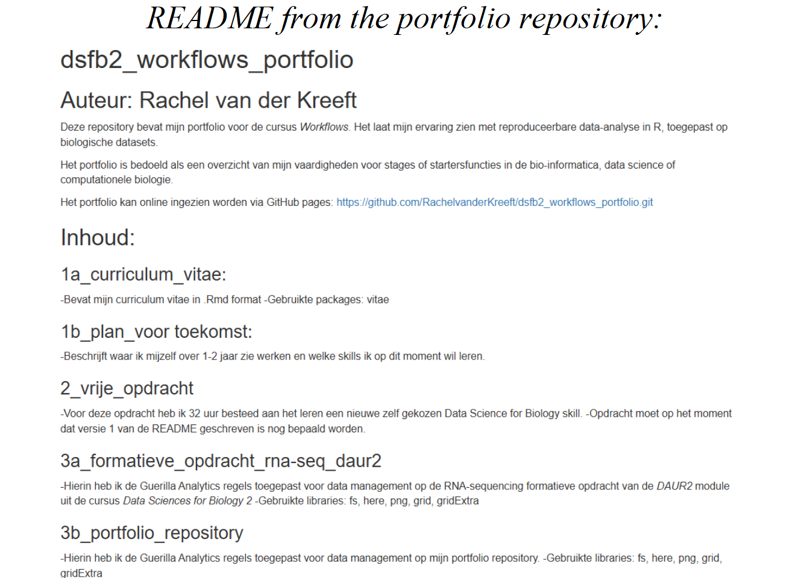

# Portfolio repository


```
## ~/documents/dsfb2/dsfb2_workflows_portfolio/dsfb2_workflows_portfolio
## ├── bookdown
## │   ├── 01-curriculum_vitae.md
## │   ├── 01-curriculum_vitae.Rmd
## │   ├── 02-plan_voor_de_toekomst.md
## │   ├── 02-plan_voor_de_toekomst.Rmd
## │   ├── 03-vrije_opdracht_introductie.md
## │   ├── 03-vrije_opdracht_introductie.Rmd
## │   ├── 04-formatieve_opdracht_rna-seq_daur2_files
## │   │   ├── figure-epub3
## │   │   │   ├── readme-1.png
## │   │   │   └── readme-2.png
## │   │   ├── figure-html
## │   │   │   ├── readme-1.png
## │   │   │   └── readme-2.png
## │   │   └── figure-latex
## │   │       ├── readme-1.pdf
## │   │       └── readme-2.pdf
## │   ├── 04-vrije_opdracht_uitvoering.md
## │   ├── 04-vrije_opdracht_uitvoering.Rmd
## │   ├── 04-vrije_opdracht_uitvoering_files
## │   │   └── figure-html
## │   │       ├── threshold vergelijking-1.png
## │   │       ├── unnamed-chunk-12-1.png
## │   │       ├── unnamed-chunk-15-1.png
## │   │       ├── unnamed-chunk-16-1.png
## │   │       ├── unnamed-chunk-17-1.png
## │   │       ├── unnamed-chunk-20-1.png
## │   │       ├── unnamed-chunk-22-1.png
## │   │       ├── unnamed-chunk-24-1.png
## │   │       ├── unnamed-chunk-25-1.png
## │   │       ├── unnamed-chunk-29-1.png
## │   │       ├── unnamed-chunk-32-1.png
## │   │       ├── unnamed-chunk-6-1.png
## │   │       └── unnamed-chunk-8-1.png
## │   ├── 05-formatieve_opdracht_rna-seq_daur2.md
## │   ├── 05-formatieve_opdracht_rna-seq_daur2.Rmd
## │   ├── 05-formatieve_opdracht_rna-seq_daur2_files
## │   │   └── figure-html
## │   │       ├── readme-1.png
## │   │       └── readme-2.png
## │   ├── 05-portfolio_repository_files
## │   │   ├── figure-epub3
## │   │   │   └── readme-1.png
## │   │   ├── figure-html
## │   │   │   └── readme-1.png
## │   │   └── figure-latex
## │   │       └── readme-1.pdf
## │   ├── 06-data_analyse_van_een_ander_reproduceren_files
## │   │   ├── figure-epub3
## │   │   │   ├── normalised scatterplot-1.png
## │   │   │   └── Scatterplot-1.png
## │   │   ├── figure-html
## │   │   │   ├── normalised scatterplot-1.png
## │   │   │   └── Scatterplot-1.png
## │   │   └── figure-latex
## │   │       ├── normalised scatterplot-1.pdf
## │   │       └── Scatterplot-1.pdf
## │   ├── 06-portfolio_repository.Rmd
## │   ├── 06-portfolio_repository_files
## │   │   └── figure-html
## │   │       └── readme-1.png
## │   ├── 07-artikel_beoordelen_op_reproduceerbaarheid_files
## │   │   ├── figure-epub3
## │   │   │   └── ggplot-1.png
## │   │   ├── figure-html
## │   │   │   └── ggplot-1.png
## │   │   └── figure-latex
## │   │       └── ggplot-1.pdf
## │   ├── 07-data_analyse_van_een_ander_reproduceren.Rmd
## │   ├── 07-data_analyse_van_een_ander_reproduceren_files
## │   │   └── figure-html
## │   │       ├── normalised scatterplot-1.png
## │   │       └── Scatterplot-1.png
## │   ├── 08-artikel_beoordelen_op_reproduceerbaarheid.Rmd
## │   ├── 08-artikel_beoordelen_op_reproduceerbaarheid_files
## │   │   └── figure-html
## │   │       └── ggplot-1.png
## │   ├── 09-r_package.Rmd
## │   ├── 10-bronvermelding.Rmd
## │   ├── 11-geparametrizeerde_rmarkdown.Rmd
## │   ├── bibliography.bib
## │   ├── bookdown-demo.tex
## │   ├── bookdown-portfolio.log
## │   ├── bookdown-portfolio.rds
## │   ├── bookdown-portfolio.Rproj
## │   ├── covid_Netherlands_2022_7-12.html
## │   ├── curriculum_vitae.html
## │   ├── DESCRIPTION
## │   ├── Dockerfile
## │   ├── index.md
## │   ├── index.Rmd
## │   ├── LICENSE
## │   ├── now.json
## │   ├── packages.bib
## │   ├── preamble.tex
## │   ├── render6038120d6327.rds
## │   ├── style.css
## │   ├── toc.css
## │   ├── vancouver-ama.csl
## │   ├── _book
## │   │   ├── 01-curriculum_vitae.md
## │   │   ├── 02-plan_voor_de_toekomst.md
## │   │   ├── 03-vrije_opdracht_introductie.md
## │   │   ├── 04-vrije_opdracht_uitvoering.md
## │   │   ├── 04-vrije_opdracht_uitvoering_files
## │   │   │   └── figure-html
## │   │   │       ├── threshold vergelijking-1.png
## │   │   │       ├── unnamed-chunk-12-1.png
## │   │   │       ├── unnamed-chunk-15-1.png
## │   │   │       ├── unnamed-chunk-16-1.png
## │   │   │       ├── unnamed-chunk-17-1.png
## │   │   │       ├── unnamed-chunk-20-1.png
## │   │   │       ├── unnamed-chunk-22-1.png
## │   │   │       ├── unnamed-chunk-24-1.png
## │   │   │       ├── unnamed-chunk-25-1.png
## │   │   │       ├── unnamed-chunk-29-1.png
## │   │   │       ├── unnamed-chunk-32-1.png
## │   │   │       ├── unnamed-chunk-6-1.png
## │   │   │       └── unnamed-chunk-8-1.png
## │   │   ├── 05-formatieve_opdracht_rna-seq_daur2.md
## │   │   ├── 05-formatieve_opdracht_rna-seq_daur2_files
## │   │   │   └── figure-html
## │   │   │       ├── readme-1.png
## │   │   │       └── readme-2.png
## │   │   ├── 06-portfolio_repository.md
## │   │   ├── 06-portfolio_repository_files
## │   │   │   └── figure-html
## │   │   │       └── readme-1.png
## │   │   ├── 07-data_analyse_van_een_ander_reproduceren.md
## │   │   ├── 07-data_analyse_van_een_ander_reproduceren_files
## │   │   │   └── figure-html
## │   │   │       ├── normalised scatterplot-1.png
## │   │   │       └── Scatterplot-1.png
## │   │   ├── 08-artikel_beoordelen_op_reproduceerbaarheid.md
## │   │   ├── 08-artikel_beoordelen_op_reproduceerbaarheid_files
## │   │   │   └── figure-html
## │   │   │       └── ggplot-1.png
## │   │   ├── 09-r_package.md
## │   │   ├── 10-bronvermelding.md
## │   │   ├── 11-geparametrizeerde_rmarkdown.md
## │   │   ├── 404.html
## │   │   ├── artikel-beoordelen-op-reproduceerbaarheid.html
## │   │   ├── bronvermelding.html
## │   │   ├── covid_Netherlands_2022_7-12.html
## │   │   ├── curriculum-vitae.html
## │   │   ├── curriculum_vitae.html
## │   │   ├── data-analyse-van-een-ander-reproduceren.html
## │   │   ├── geparametrizeerde-rmarkdown.html
## │   │   ├── index.html
## │   │   ├── index.md
## │   │   ├── libs
## │   │   │   ├── anchor-sections-1.1.0
## │   │   │   │   ├── anchor-sections-hash.css
## │   │   │   │   ├── anchor-sections.css
## │   │   │   │   └── anchor-sections.js
## │   │   │   ├── gitbook-2.6.7
## │   │   │   │   ├── css
## │   │   │   │   │   ├── fontawesome
## │   │   │   │   │   │   └── fontawesome-webfont.ttf
## │   │   │   │   │   ├── plugin-bookdown.css
## │   │   │   │   │   ├── plugin-clipboard.css
## │   │   │   │   │   ├── plugin-fontsettings.css
## │   │   │   │   │   ├── plugin-highlight.css
## │   │   │   │   │   ├── plugin-search.css
## │   │   │   │   │   ├── plugin-table.css
## │   │   │   │   │   └── style.css
## │   │   │   │   └── js
## │   │   │   │       ├── app.min.js
## │   │   │   │       ├── clipboard.min.js
## │   │   │   │       ├── jquery.highlight.js
## │   │   │   │       ├── plugin-bookdown.js
## │   │   │   │       ├── plugin-clipboard.js
## │   │   │   │       ├── plugin-fontsettings.js
## │   │   │   │       ├── plugin-search.js
## │   │   │   │       └── plugin-sharing.js
## │   │   │   └── jquery-3.6.0
## │   │   │       └── jquery-3.6.0.min.js
## │   │   ├── plan-voor-de-toekomst.html
## │   │   ├── portfolio-repository.html
## │   │   ├── r-package.html
## │   │   ├── rna-sequencing-repository.html
## │   │   ├── search_index.json
## │   │   ├── style.css
## │   │   ├── vrije-opdracht-introductie.html
## │   │   └── vrije-opdracht-uitvoering.html
## │   ├── _bookdown.yml
## │   ├── _bookdown_files
## │   ├── _build.sh
## │   ├── _deploy.sh
## │   ├── _output.yml
## │   └── _publish.R
## ├── docs
## │   ├── 01-curriculum_vitae.md
## │   ├── 02-plan_voor_de_toekomst.md
## │   ├── 03-vrije_opdracht_introductie.md
## │   ├── 04-vrije_opdracht_uitvoering.md
## │   ├── 04-vrije_opdracht_uitvoering_files
## │   │   └── figure-html
## │   │       ├── threshold vergelijking-1.png
## │   │       ├── unnamed-chunk-12-1.png
## │   │       ├── unnamed-chunk-15-1.png
## │   │       ├── unnamed-chunk-16-1.png
## │   │       ├── unnamed-chunk-17-1.png
## │   │       ├── unnamed-chunk-20-1.png
## │   │       ├── unnamed-chunk-22-1.png
## │   │       ├── unnamed-chunk-24-1.png
## │   │       ├── unnamed-chunk-6-1.png
## │   │       └── unnamed-chunk-8-1.png
## │   ├── 05-formatieve_opdracht_rna-seq_daur2.md
## │   ├── 05-formatieve_opdracht_rna-seq_daur2_files
## │   │   └── figure-html
## │   │       ├── readme-1.png
## │   │       └── readme-2.png
## │   ├── 06-portfolio_repository.md
## │   ├── 06-portfolio_repository_files
## │   │   └── figure-html
## │   │       └── readme-1.png
## │   ├── 07-data_analyse_van_een_ander_reproduceren.md
## │   ├── 07-data_analyse_van_een_ander_reproduceren_files
## │   │   └── figure-html
## │   │       ├── normalised scatterplot-1.png
## │   │       └── Scatterplot-1.png
## │   ├── 08-artikel_beoordelen_op_reproduceerbaarheid.md
## │   ├── 08-artikel_beoordelen_op_reproduceerbaarheid_files
## │   │   └── figure-html
## │   │       └── ggplot-1.png
## │   ├── 09-r_package.md
## │   ├── 10-bronvermelding.md
## │   ├── 11-geparametrizeerde_rmarkdown.md
## │   ├── 404.html
## │   ├── artikel-beoordelen-op-reproduceerbaarheid.html
## │   ├── bronvermelding.html
## │   ├── covid_Netherlands_2022_7-12.html
## │   ├── curriculum-vitae.html
## │   ├── curriculum_vitae.html
## │   ├── data-analyse-van-een-ander-reproduceren.html
## │   ├── geparametrizeerde-rmarkdown.html
## │   ├── index.html
## │   ├── index.md
## │   ├── libs
## │   │   ├── anchor-sections-1.1.0
## │   │   │   ├── anchor-sections-hash.css
## │   │   │   ├── anchor-sections.css
## │   │   │   └── anchor-sections.js
## │   │   ├── gitbook-2.6.7
## │   │   │   ├── css
## │   │   │   │   ├── fontawesome
## │   │   │   │   │   └── fontawesome-webfont.ttf
## │   │   │   │   ├── plugin-bookdown.css
## │   │   │   │   ├── plugin-clipboard.css
## │   │   │   │   ├── plugin-fontsettings.css
## │   │   │   │   ├── plugin-highlight.css
## │   │   │   │   ├── plugin-search.css
## │   │   │   │   ├── plugin-table.css
## │   │   │   │   └── style.css
## │   │   │   └── js
## │   │   │       ├── app.min.js
## │   │   │       ├── clipboard.min.js
## │   │   │       ├── jquery.highlight.js
## │   │   │       ├── plugin-bookdown.js
## │   │   │       ├── plugin-clipboard.js
## │   │   │       ├── plugin-fontsettings.js
## │   │   │       ├── plugin-search.js
## │   │   │       └── plugin-sharing.js
## │   │   └── jquery-3.6.0
## │   │       └── jquery-3.6.0.min.js
## │   ├── plan-voor-de-toekomst.html
## │   ├── portfolio-repository.html
## │   ├── r-package.html
## │   ├── reference-keys.txt
## │   ├── rna-sequencing-repository.html
## │   ├── search_index.json
## │   ├── style.css
## │   ├── vrije-opdracht-introductie.html
## │   └── vrije-opdracht-uitvoering.html
## ├── dsfb2_workflows_portfolio.Rproj
## ├── projecten
## │   ├── 1a_curriculum_vitae
## │   │   ├── curriculum_vitae.html
## │   │   ├── curriculum_vitae.Rmd
## │   │   ├── fonts
## │   │   │   ├── academicons.eot
## │   │   │   ├── academicons.svg
## │   │   │   ├── academicons.ttf
## │   │   │   └── academicons.woff
## │   │   ├── LICENSE
## │   │   ├── media
## │   │   │   ├── academicons.min.css
## │   │   │   ├── blmoore-print.css
## │   │   │   ├── blmoore-screen.css
## │   │   │   ├── ccbaumler-print.css
## │   │   │   ├── ccbaumler-screen.css
## │   │   │   ├── davewhipp-print.css
## │   │   │   ├── davewhipp-screen.css
## │   │   │   ├── kjhealy-print.css
## │   │   │   └── kjhealy-screen.css
## │   │   └── packages.bib
## │   ├── 1b_plan_voor_de_toekomst
## │   │   ├── plan_voor_de_toekomst.html
## │   │   ├── plan_voor_de_toekomst.Rmd
## │   │   └── README.md
## │   ├── 2_vrije_opdracht
## │   │   ├── achtergrond
## │   │   │   ├── NGS WGS presentatie.pptx
## │   │   │   ├── Presentatie Parodontitis 16s sequencing eindversie.pptx
## │   │   │   ├── read_length_vs_quality_filtered_original analysis.png
## │   │   │   └── Resultaten lab parodontitis project.xlsx
## │   │   ├── analyses
## │   │   │   ├── bracken
## │   │   │   │   ├── 16S_exp1_11122025_bracken_species_threshold0.bracken
## │   │   │   │   ├── 16S_exp1_11122025_bracken_species_threshold0.bracken.txt
## │   │   │   │   ├── 16S_exp1_11122025_bracken_species_threshold5.bracken
## │   │   │   │   ├── 16S_exp1_11122025_bracken_species_threshold5.txt
## │   │   │   │   ├── 16S_exp1_11122025_bracken_species_threshold50.bracken
## │   │   │   │   └── 16S_exp1_11122025_bracken_species_threshold50.txt
## │   │   │   ├── fastqc
## │   │   │   │   ├── mock1_kraken_bracken_species_threshold0.html
## │   │   │   │   └── mock1_kraken_bracken_species_threshold5.html
## │   │   │   ├── kraken2
## │   │   │   │   └── 16S_exp1_11122025.report
## │   │   │   ├── krona
## │   │   │   │   ├── 16S_exp1_11122025_bracken_species_threshold0.html
## │   │   │   │   ├── 16S_exp1_11122025_bracken_species_threshold5.html
## │   │   │   │   ├── 16S_exp1_11122025_bracken_species_threshold50.html
## │   │   │   │   ├── mock1_kraken_bracken_species_threshold0.html
## │   │   │   │   └── mock1_kraken_bracken_species_threshold5.html
## │   │   │   ├── nanoplot_filtered
## │   │   │   │   ├── NanoPlot-report.html
## │   │   │   │   ├── NanoStats.txt
## │   │   │   │   └── read_length_vs_quality_filtered.png
## │   │   │   └── nanoplot_not_filtered
## │   │   │       ├── NanoPlot-report.html
## │   │   │       ├── NanoStats.txt
## │   │   │       └── read_length_vs_quality_not_filtered.png
## │   │   ├── data
## │   │   │   └── relatieve_prevalentie_vergelijking.xlsx
## │   │   ├── metadata
## │   │   │   └── overzicht_gebruikte_flowcells.xlsx
## │   │   ├── README.md
## │   │   ├── scripts
## │   │   ├── verslag
## │   │   │   ├── 16S_exp1_11122025_bracken_species_controle.png
## │   │   │   ├── 16S_exp1_11122025_bracken_species_patienten.png
## │   │   │   ├── 16S_exp1_11122025_bracken_species_threshold0.png
## │   │   │   ├── 16S_exp1_11122025_bracken_species_threshold5.png
## │   │   │   ├── 16S_exp1_11122025_bracken_species_threshold50.png
## │   │   │   ├── 16S_exp1_11122025_kraken2_species_threshold0.png
## │   │   │   ├── fastqc_mock2_R1_per_base_quality.png
## │   │   │   ├── fastqc_mock2_R2_per_base_quality.png
## │   │   │   ├── mock1_kraken_bracken_species_threshold0.png
## │   │   │   └── mock1_kraken_bracken_species_threshold5.png
## │   │   ├── vrije_opdracht_introductie.html
## │   │   ├── vrije_opdracht_introductie.Rmd
## │   │   ├── vrije_opdracht_uitvoering.html
## │   │   └── vrije_opdracht_uitvoering.Rmd
## │   ├── 3a_formatieve_opdracht_rna-seq_daur2
## │   │   ├── formatieve_opdracht_rna-seq_daur2.html
## │   │   ├── formatieve_opdracht_rna-seq_daur2.Rmd
## │   │   ├── readme_screenshot_3a_1.png
## │   │   ├── readme_screenshot_3a_2.png
## │   │   └── rnaseq_ipsc
## │   │       ├── analyses
## │   │       │   └── fastqc
## │   │       │       ├── SRR7866687_1.fastq.html
## │   │       │       ├── SRR7866687_1.fastq.zip
## │   │       │       ├── SRR7866687_2.fastq.html
## │   │       │       ├── SRR7866687_2.fastq.zip
## │   │       │       ├── SRR7866688_1.fastq.html
## │   │       │       ├── SRR7866688_1.fastq.zip
## │   │       │       ├── SRR7866688_2.fastq.html
## │   │       │       ├── SRR7866688_2.fastq.zip
## │   │       │       ├── SRR7866689_1.fastq.html
## │   │       │       ├── SRR7866689_1.fastq.zip
## │   │       │       ├── SRR7866689_2.fastq.html
## │   │       │       ├── SRR7866689_2.fastq.zip
## │   │       │       ├── SRR7866690_1.fastq.html
## │   │       │       ├── SRR7866690_1.fastq.zip
## │   │       │       ├── SRR7866690_2.fastq.html
## │   │       │       ├── SRR7866690_2.fastq.zip
## │   │       │       ├── SRR7866691_1.fastq.html
## │   │       │       ├── SRR7866691_1.fastq.zip
## │   │       │       ├── SRR7866691_2.fastq.html
## │   │       │       ├── SRR7866691_2.fastq.zip
## │   │       │       ├── SRR7866692_1.fastq.html
## │   │       │       ├── SRR7866692_1.fastq.zip
## │   │       │       ├── SRR7866692_2.fastq.html
## │   │       │       ├── SRR7866692_2.fastq.zip
## │   │       │       ├── SRR7866693_1.fastq.html
## │   │       │       ├── SRR7866693_1.fastq.zip
## │   │       │       ├── SRR7866693_2.fastq.html
## │   │       │       ├── SRR7866693_2.fastq.zip
## │   │       │       ├── SRR7866694_1.fastq.html
## │   │       │       ├── SRR7866694_1.fastq.zip
## │   │       │       ├── SRR7866694_2.fastq.html
## │   │       │       └── SRR7866694_2.fastq.zip
## │   │       ├── data
## │   │       │   ├── alignment
## │   │       │   │   ├── alignment_statistics.rds
## │   │       │   │   ├── SRR7866687.bam
## │   │       │   │   ├── SRR7866687.bam.indel.vcf
## │   │       │   │   ├── SRR7866687.bam.summary
## │   │       │   │   ├── SRR7866688.bam
## │   │       │   │   ├── SRR7866688.bam.indel.vcf
## │   │       │   │   ├── SRR7866688.bam.summary
## │   │       │   │   ├── SRR7866689.bam
## │   │       │   │   ├── SRR7866689.bam.indel.vcf
## │   │       │   │   ├── SRR7866689.bam.summary
## │   │       │   │   ├── SRR7866690.bam
## │   │       │   │   ├── SRR7866690.bam.indel.vcf
## │   │       │   │   ├── SRR7866690.bam.summary
## │   │       │   │   ├── SRR7866691.bam
## │   │       │   │   ├── SRR7866691.bam.indel.vcf
## │   │       │   │   ├── SRR7866691.bam.summary
## │   │       │   │   ├── SRR7866692.bam
## │   │       │   │   ├── SRR7866692.bam.indel.vcf
## │   │       │   │   ├── SRR7866692.bam.summary
## │   │       │   │   ├── SRR7866693.bam
## │   │       │   │   ├── SRR7866693.bam.indel.vcf
## │   │       │   │   ├── SRR7866693.bam.summary
## │   │       │   │   ├── SRR7866694.bam
## │   │       │   │   ├── SRR7866694.bam.indel.vcf
## │   │       │   │   └── SRR7866694.bam.summary
## │   │       │   └── counts
## │   │       │       └── read_counts.rds
## │   │       ├── formatieve_opdracht_iPSC.Rmd
## │   │       ├── raw_data
## │   │       │   ├── fastq
## │   │       │   │   ├── SRR7866687_1.fastq.gz
## │   │       │   │   ├── SRR7866687_2.fastq.gz
## │   │       │   │   ├── SRR7866688_1.fastq.gz
## │   │       │   │   ├── SRR7866688_2.fastq.gz
## │   │       │   │   ├── SRR7866689_1.fastq.gz
## │   │       │   │   ├── SRR7866689_2.fastq.gz
## │   │       │   │   ├── SRR7866690_1.fastq.gz
## │   │       │   │   ├── SRR7866690_2.fastq.gz
## │   │       │   │   ├── SRR7866691_1.fastq.gz
## │   │       │   │   ├── SRR7866691_2.fastq.gz
## │   │       │   │   ├── SRR7866692_1.fastq.gz
## │   │       │   │   ├── SRR7866692_2.fastq.gz
## │   │       │   │   ├── SRR7866693_1.fastq.gz
## │   │       │   │   ├── SRR7866693_2.fastq.gz
## │   │       │   │   ├── SRR7866694_1.fastq.gz
## │   │       │   │   └── SRR7866694_2.fastq.gz
## │   │       │   └── ipsc_sampledata
## │   │       │       └── ipsc_sampledata.csv
## │   │       ├── README.md
## │   │       ├── reference
## │   │       │   └── hg38_index
## │   │       │       ├── hg38_index.00.b.array
## │   │       │       ├── hg38_index.00.b.tab
## │   │       │       ├── hg38_index.files
## │   │       │       ├── hg38_index.log
## │   │       │       └── hg38_index.reads
## │   │       └── scripts
## │   │           ├── aligning_reads.Rmd
## │   │           ├── annotation_DE_genes.R
## │   │           ├── correlations_heatmap.R
## │   │           ├── count_plots.R
## │   │           ├── count_table.R
## │   │           ├── deseq_object.Rmd
## │   │           ├── dge_analysis.R
## │   │           ├── fastqc_analysis.sh
## │   │           ├── fastq_download.sh
## │   │           ├── go_term_enrichment_analysis.R
## │   │           ├── heatmap_scaling.R
## │   │           ├── normalizing_RNA-seq_count_data.R
## │   │           ├── principal_component_analysis.R
## │   │           ├── volcano_plots.R
## │   │           └── workflow.Rmd
## │   ├── 3b_portfolio_repository
## │   │   ├── portfolio_repository.html
## │   │   ├── portfolio_repository.Rmd
## │   │   └── readme_screenshot.png
## │   ├── 4a_data_analyse_van_een_ander_reproduceren
## │   │   ├── CE.LIQ.FLOW.062_Tidydata.xlsx
## │   │   ├── data_analyse_van_een_ander_reproduceren.html
## │   │   └── data_analyse_van_een_ander_reproduceren.Rmd
## │   ├── 4b_artikel_beoordelen_op_reproduceerbaarheid
## │   │   ├── 4b_artikel_beoordelen_op_reproduceerbaarheid.html
## │   │   ├── 4b_artikel_beoordelen_op_reproduceerbaarheid.Rmd
## │   │   └── Death data(18-64).xlsx
## │   ├── 7_bronvermelding
## │   │   ├── 7_bronvermelding.html
## │   │   ├── 7_bronvermelding.Rmd
## │   │   ├── bibliography.bib
## │   │   └── vancouver-ama.csl
## │   └── 8_geparametrizeerde_rmarkdown
## │       ├── covid-19_in_europa.html
## │       ├── covid-19_in_europa.Rmd
## │       ├── covid-19_in_europa_static_version.Rmd
## │       ├── covid_Netherlands_2022_7-12.html
## │       ├── data.csv
## │       ├── data.xlsx
## │       └── render_covid-19_in_europa_reports.R
## ├── prompts
## │   └── artikel_beoordelen_op_reproduceerbaarheid
## ├── README.html
## └── README.md
```





